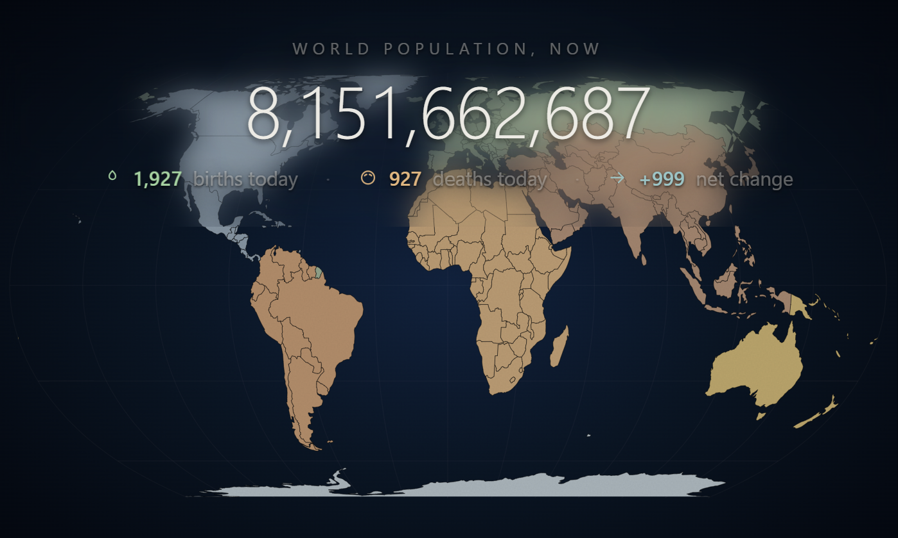

# Pulse of Humanity

> Cinematic world population visualization served by Flask and driven by a deterministic UN WPP-based simulation.

[](https://www.gnu.org/licenses/gpl-3.0)
[](https://www.python.org/)
[](https://flask.palletsprojects.com/)
[](https://render.com)

---

## Demo



*The current production UI: cinematic counter, continent hover detail, and Equal Earth map rendered from the isolated screensaver bundle.*

---

## Cinematic Earth Screensaver (v2.0.0)

- Live app: [pulseofhumanity.org](https://pulseofhumanity.org/)
- Static entrypoint: [/screensaver/index.html](https://pulseofhumanity.org/screensaver/index.html)
- Download: [/static/screensaver.zip](https://pulseofhumanity.org/static/screensaver.zip)
- Fully offline, deterministic, and standalone on the frontend side

---

## Features

- **Cinematic Homepage** — `/` redirects to the static screensaver bundle entrypoint without rewriting asset paths
- **Deterministic Population Simulation** — the browser animates from a fixed server anchor derived from UN WPP rates
- **Interactive Globe Experience** — Equal Earth projection, continent hover panel, and motion-aware counter system
- **Standalone Frontend Bundle** — screensaver assets, styles, and modules live under `screensaver/` and can be served statically
- **Flask JSON Surface** — `/api/live-state`, `/population`, and `/health` remain available for backend consumers and verification
- **Deployment Hardening** — HTTPS redirect behavior, CSP/HSTS headers, and rate limiting remain in `app.py`

## Tech Stack

| Layer | Technology |
|-------|-----------|
| Backend | Python 3.11+ / Flask 3.x |
| Frontend | Static HTML, CSS, and ES modules in `screensaver/` |
| Visualization | TopoJSON world data, Equal Earth SVG rendering, cinematic overlays |
| Security | Flask-Limiter, Flask-WTF support code, security headers |
| Deployment | Gunicorn, Render-ready (`render.yaml`) |

## Routes

| Endpoint | Method | Description |
|----------|--------|-------------|
| `/` | GET | Redirects to `/screensaver/index.html` |
| `/screensaver/index.html` | GET | Current cinematic homepage |
| `/screensaver/<path:path>` | GET | Serves the static screensaver bundle |
| `/pulse`, `/home`, `/about`, `/contact`, `/privacy`, `/screensaver` | GET/POST | Legacy public paths redirected to `/screensaver/index.html` |
| `/api/live-state` | GET | JSON anchor for the population simulation |
| `/population` | GET | JSON snapshot of current population state |
| `/health` | GET | Health check for uptime monitoring |

## Development Setup

```bash
# Clone and create a virtual environment
git clone https://github.com/GnuJason/Pulse-of-Humanity.git
cd Pulse-of-Humanity
python3 -m venv venv
source venv/bin/activate
pip install -r requirements.txt

# Configure environment
cp .env.example .env   # edit with your values

# Run locally
python app.py           # http://localhost:10000
```

### Production (Gunicorn)

```bash
gunicorn --config gunicorn.conf.py app:app
```

### Useful Commands

```bash
python validate_env.py      # check environment variables
python security_audit.py    # run security checks
./venv/bin/python -m pytest tests/test_population_model.py -v
```

### Environment Variables

| Variable | Required | Default | Description |
|----------|----------|---------|-------------|
| `FLASK_SECRET_KEY` | **Yes** (prod) | random | Session secret key |
| `PORT` | No | `10000` | Server port |
| `RUN_UPDATER` | No | `1` | Enable background annual anchor checks |
| `POP_ANCHOR_MONTH` | No | `1` | Month for yearly authoritative re-anchor |
| `POP_ANCHOR_DAY` | No | `1` | Day for yearly authoritative re-anchor |
| `ADMIN_REANCHOR_TOKEN` | No | — | Token required for `POST /admin/reanchor` |
| `DOMAIN` | No | `localhost:5000` | Production domain |

## Deployment (Render)

1. Fork this repository
2. Create a new **Web Service** on [Render](https://render.com) connected to your fork
3. Render auto-detects the included `render.yaml`
4. Set `FLASK_SECRET_KEY` and optional SMTP variables in the Render dashboard

## Contributing

See [CONTRIBUTING.md](CONTRIBUTING.md) for setup instructions, how to run tests, and PR guidelines.

## Changelog

See [CHANGELOG.md](CHANGELOG.md) for a history of changes by release.

## License

This project is licensed under the **GNU General Public License v3.0** — see [LICENSE](LICENSE) for details.

## Acknowledgments

- [United Nations World Population Prospects 2024 Revision](https://population.un.org/wpp/) — source basis for the fixed annual anchor values used by the application.
- The live ticker is computed locally from a deterministic annual anchor using fixed UN WPP-based demographic rates; normal operation does not require external API calls or live population feeds.
- Deprecated sources no longer used: API Ninjas, Worldometer scraping, hourly refresh APIs, and snapshot-based population feeds.
- [Natural Earth](https://www.naturalearthdata.com/) — geographic data
- [TopoJSON](https://github.com/topojson/topojson) — compact geographic geometry for the screensaver bundle
