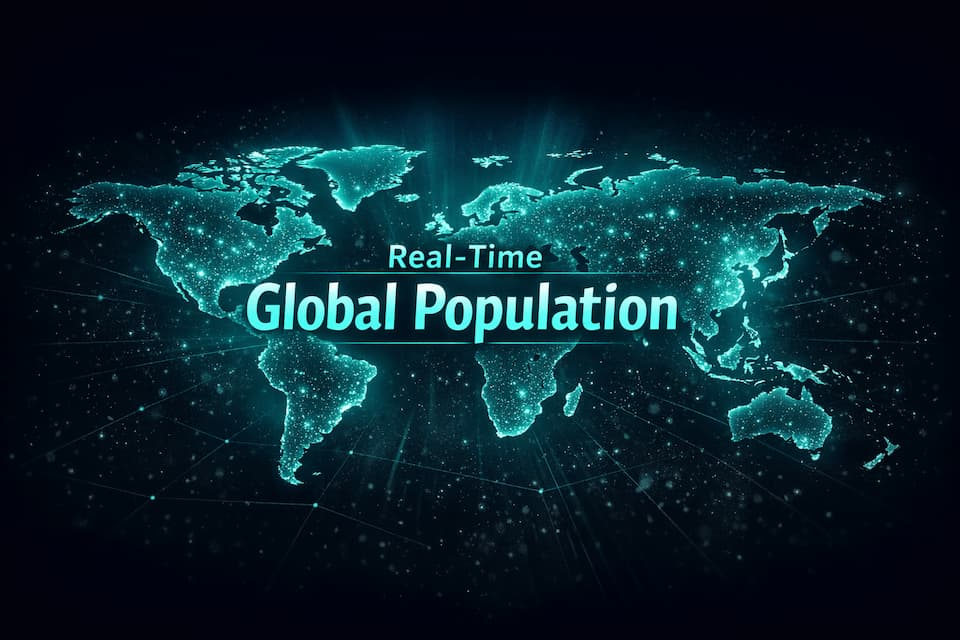
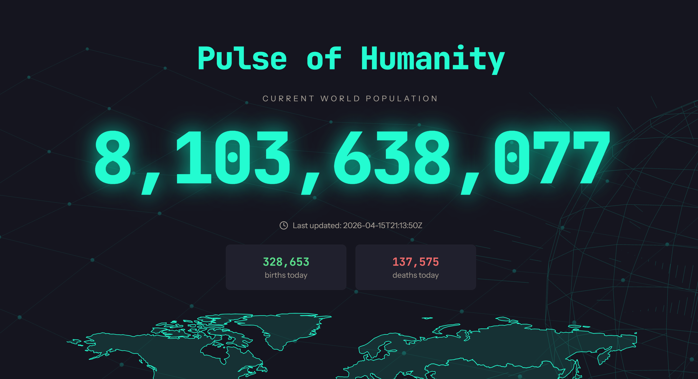

<p align="center">
  
</p>

# Pulse of Humanity

> Real-time world population visualization with an interactive SVG map, animated 3D globe, and cinematic design.

[](https://www.gnu.org/licenses/gpl-3.0)
[](https://www.python.org/)
[](https://flask.palletsprojects.com/)
[](https://render.com)
[]()


<!-- TOPIC TAGS: flask, population, data-visualization, real-time, tailwindcss, python, demographics, open-data -->

---

## Demo



*Live counter, continental breakdown, and interactive SVG world map with VANTA.js globe background.*

---

## Features

- **Real-time Population Counter** — live-updating display with smooth easing animations
- **Interactive World Map** — embedded SVG with per-continent population, births, and deaths tooltips
- **Continental Breakdown** — stat cards showing population share by continent
- **VANTA.js Globe** — animated 3D globe background for cinematic atmosphere
- **Contact Form** — server-side validation, math captcha, rate limiting, CSRF protection, SMTP email
- **Mobile Responsive** — touch-optimized with adaptive layouts for all screen sizes
- **Keyboard Accessible** — Enter/Space activation on interactive SVG continents
- **Security** — HTTPS redirect, CSP headers, HSTS, rate limiting, input sanitization

## Tech Stack

| Layer | Technology |
|-------|-----------|
| Backend | Python 3.11+ / Flask 3.x |
| Frontend | HTML5, Tailwind CSS (compiled), vanilla JS |
| Fonts | JetBrains Mono (display) + Instrument Sans (body) |
| Visualization | Embedded SVG world map, VANTA.js 3D globe |
| Security | Flask-WTF (CSRF), Flask-Limiter, security headers |
| Deployment | Gunicorn, Render-ready (`render.yaml`) |

## API Endpoints

| Endpoint | Method | Description |
|----------|--------|-------------|
| `/` | GET | Main population visualization |
| `/api/live-state` | GET | JSON — authoritative ticker anchor: `baselinePopulation`, `baselineTimestamp`, `birthsPerSecond`, `deathsPerSecond`, `serverTimestamp`, `source` |
| `/population` | GET | JSON — current population and data source |
| `/health` | GET | Health check for uptime monitoring |
| `/contact` | GET/POST | Contact form with CSRF + captcha |
| `/about` | GET | About page |
| `/privacy` | GET | Privacy policy |

## Development Setup

```bash
# Clone and create a virtual environment
git clone https://github.com/GnuJason/Pulse-of-Humanity.git
cd Pulse-of-Humanity
python3 -m venv venv
source venv/bin/activate
pip install -r requirements.txt

# Configure environment
cp .env.example .env   # edit with your values

# Run locally
python app.py           # http://localhost:10000
```

### Production (Gunicorn)

```bash
gunicorn --config gunicorn.conf.py app:app
```

### Useful Commands

```bash
python validate_env.py      # check environment variables
python security_audit.py    # run security checks
./venv/bin/python -m pytest tests/test_population_model.py -v
node --test tests/population_ticker.test.cjs
```

### Environment Variables

| Variable | Required | Default | Description |
|----------|----------|---------|-------------|
| `FLASK_SECRET_KEY` | **Yes** (prod) | random | Session secret key |
| `PORT` | No | `10000` | Server port |
| `RUN_UPDATER` | No | `1` | Enable background population sync |
| `API_NINJAS_KEY` | No | — | API Ninjas key for population data |
| `SMTP_SERVER` | No | `smtp.mailfence.com` | SMTP server for contact form |
| `SMTP_PORT` | No | `587` | SMTP port |
| `SMTP_USERNAME` | No | — | SMTP username |
| `SMTP_PASSWORD` | No | — | SMTP password |
| `RECIPIENT_EMAIL` | No | — | Contact form recipient |
| `DOMAIN` | No | `localhost:5000` | Production domain |

## Deployment (Render)

1. Fork this repository
2. Create a new **Web Service** on [Render](https://render.com) connected to your fork
3. Render auto-detects the included `render.yaml`
4. Set `FLASK_SECRET_KEY` and optional SMTP variables in the Render dashboard

## Contributing

See [CONTRIBUTING.md](CONTRIBUTING.md) for setup instructions, how to run tests, and PR guidelines.

## Changelog

See [CHANGELOG.md](CHANGELOG.md) for a history of changes by release.

## License

This project is licensed under the **GNU General Public License v3.0** — see [LICENSE](LICENSE) for details.

## Acknowledgments

- [API Ninjas](https://api-ninjas.com/) & [Worldometer](https://www.worldometers.info/) — population data
- [VANTA.js](https://www.vantajs.com/) — animated 3D backgrounds
- [Tailwind CSS](https://tailwindcss.com/) — utility-first CSS
- [Natural Earth](https://www.naturalearthdata.com/) — geographic data
- [JetBrains Mono](https://www.jetbrains.com/lp/mono/) & [Instrument Sans](https://fonts.google.com/specimen/Instrument+Sans) — typography
